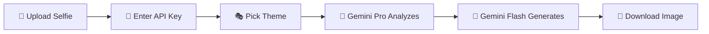

<div align="center">

# 🍌 Nano Banana

**Transform your selfies into collectible 3D action figures with AI**

[](LICENSE)
[](https://react.dev/)
[](https://www.typescriptlang.org/)
[](https://ai.google.dev/)

[Live Demo](https://nano-banana-smoky.vercel.app/) • [Features](#-features) • [Quick Start](#-quick-start) • [How It Works](#-how-it-works) • [Contributing](#-contributing)

</div>

---

## ✨ What is Nano Banana?

Nano Banana is an AI-powered toy generator that turns your selfies into **personalized 3D action figures** complete with retro 90s-style blister packaging. Upload a photo, pick a theme, and watch as AI creates a custom collectible that actually looks like you!

### 🔐 100% Client-Side & Privacy-First

- **No backend servers** — Everything runs in your browser
- **Your API key stays local** — Never sent to any server
- **No data collection** — Images are processed locally, nothing is stored
- **Download or lose it** — If you don't download, it's gone forever

### 🎬 Live Demo

**[👉 Try it now at nano-banana-smoky.vercel.app](https://nano-banana-smoky.vercel.app/)**

> *Upload a selfie → Enter your API key → Pick a theme → Get your custom action figure in seconds!*

---

## 🚀 Features

- **🎨 Personalized Action Figures** — AI analyzes your facial features to create a toy that captures your likeness
- **📦 Retro Packaging** — Every toy comes in a generated 90s-style blister pack with unique theming
- **🎭 Multiple Themes** — Choose from Space Explorer, Rock Star, Superhero, and more
- **💾 Local Collection** — Save favorites to your browser's local storage
- **⚡ Powered by Gemini Flash** — Fast, free AI for both analysis and image generation
- **🔒 Privacy by Design** — Runs entirely in your browser, no server needed

---

## 🛠️ Tech Stack

| Category | Technology |
|----------|------------|
| **Frontend** | React 19, TypeScript, Tailwind CSS |
| **Build Tool** | Vite |
| **Animations** | Framer Motion |
| **AI/ML** | Google Gemini 2.5 Flash (client-side) |
| **Icons** | Lucide React |

---

## 🏁 Quick Start

### Using the Live App

1. Visit the **[Live Demo](https://nano-banana-smoky.vercel.app/)**
2. Click "Make My Toy"
3. Enter your [FREE Gemini API key](https://aistudio.google.com/api-keys)
4. Upload a selfie and pick a theme
5. Download your generated action figure!

### Running Locally

```bash
# Clone the repository
git clone https://github.com/anassagd432/Nano-Banana.git
cd Nano-Banana

# Install dependencies
npm install

# Start development server
npm run dev
```

The app will be available at `http://localhost:5173`

> **Note:** You'll need a [FREE Google Gemini API key](https://aistudio.google.com/api-keys) to generate images. Get yours in seconds!

---

## ⚙️ How It Works



1. **Upload** — Select a clear selfie photo
2. **API Key** — Enter your Gemini API key (stored locally, optional)
3. **Theme** — Choose from retro themes like Space Explorer, Rock Star, etc.
4. **Analysis** — Gemini Flash analyzes your facial features and creates a character concept
5. **Generation** — Gemini Flash generates the 3D toy artwork
6. **Download** — Save your creation or it's gone forever!

---

## 📁 Project Structure

```
nano-banana/
├── src/
│   ├── components/
│   │   ├── ApiKeyModal.tsx   # API key input modal
│   │   ├── Hero.tsx          # Landing hero section
│   │   ├── UploadForm.tsx    # Image upload & theme selection
│   │   ├── ResultCard.tsx    # Generated toy display
│   │   └── ...
│   ├── lib/
│   │   ├── generateToy.ts    # Client-side Gemini API calls
│   │   └── store.ts          # Local storage helpers
│   ├── pages/                # Route pages
│   └── App.tsx               # Main application
├── index.html
└── package.json
```

---

## 🤝 Contributing

Contributions are welcome! Please read our [Contributing Guide](CONTRIBUTING.md) for details.

1. Fork the repository
2. Create your feature branch (`git checkout -b feature/AmazingFeature`)
3. Commit your changes (`git commit -m 'Add some AmazingFeature'`)
4. Push to the branch (`git push origin feature/AmazingFeature`)
5. Open a Pull Request

---

## 📄 License

This project is licensed under the MIT License - see the [LICENSE](LICENSE) file for details.

---

## 👤 Author

<div align="center">

**Anass Agdi**

[](https://www.linkedin.com/in/anass-agdi)
[](https://x.com/anass_agdi)

*If you like this project, consider giving it a ⭐!*

</div>

---

<div align="center">

*Nano Banana is a portfolio project showcasing the power of multimodal AI for creative applications.*

</div>
